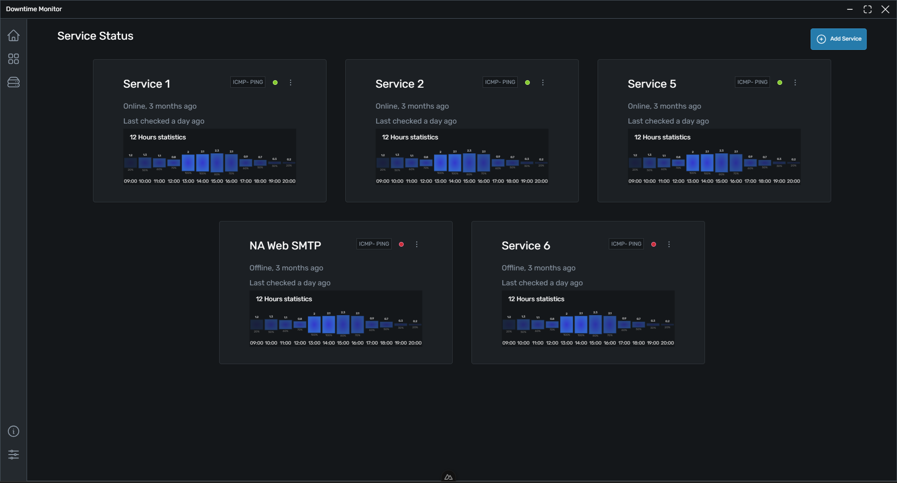

# Downtime Monitor (Nettus)

A cross-platform desktop app for monitoring network services (e.g website's, email) up time. Desgined for display in small server rooms (behind DMZ) where visual/sound notification takes precedence. Previously developed in Electron, it is now being developed as a Tauri app. Note that the current version is a work in progress and not fit for use.

***

## Dependencies

- [Tauri Apps](https://tauri.app/)

## Road Map
- [ ] Monitor Website Status
- [ ] Monitor SSL Expiry
- [ ] Monitor SMTP
- [ ] Support Extensions (possibly with [RhaiScript](https://rhai.rs/) or [Python](https://www.python.org/))
